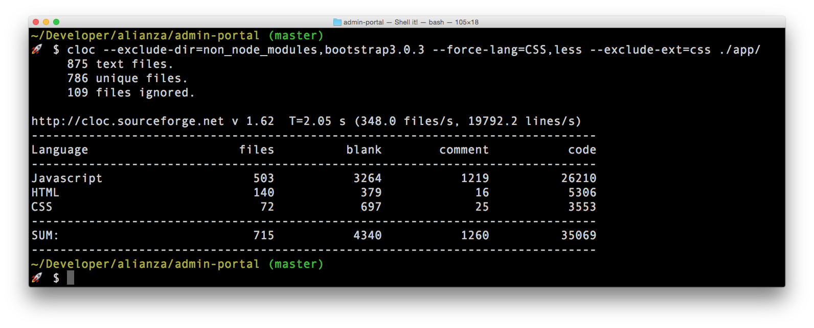

# cloc



这是 [Al Danial](https://twitter.com/pontifespresso) 开发的优秀工具 [cloc](https://github.com/AlDanial/cloc) 的 npm 发行版。
[我](https://twitter.com/kentcdodds) 创建了这个包，因为我觉得 `cloc` 非常棒，但不想下载文件并将其提交到我的项目中。

# 安装与要求

## 要求

### Perl

`cloc` 是用 Perl 编写的，这个包暴露的二进制文件是 `cloc` Perl 脚本。你的机器上必须安装 Perl 才能使用。

### Node 和 npm

这是一个 `npm` 包（有人说是 "Node Package Manager" 的缩写）。所以你必须安装 Node.js 和 npm。

以下是安装指南：
http://blog.nodeknockout.com/post/65463770933/how-to-install-node-js-and-npm

## 安装

推荐使用 `npx` 临时安装：

```bash
npx cloc [options]
```

你也可以全局或本地安装到项目中。
[了解更多](https://flaviocopes.com/npm-packages-local-global/)

# 使用方法

在终端中，只需输入 `npx cloc` 即可查看可用选项。

有关 `cloc` 的使用文档，请参阅官方 [cloc](http://cloc.sourceforge.net/) 网站。

## 基本用法

```bash
# 统计目录中的代码行数
npx cloc /path/to/directory

# 统计文件中的代码行数
npx cloc file1.js file2.js

# 比较两个代码集合的差异
npx cloc --diff dir1 dir2

# 使用 git commit hash
npx cloc abc1234 def5678
```

## 常用选项

| 选项 | 说明 |
|------|------|
| `--help` | 显示帮助信息 |
| `--version` | 显示版本号 |
| `--exclude-dir=<dir>` | 排除指定目录 |
| `--exclude-ext=<ext>` | 排除指定扩展名 |
| `--include-lang=<lang>` | 只统计指定语言 |
| `--json` | 以 JSON 格式输出 |
| `--csv` | 以 CSV 格式输出 |
| `--quiet` | 静默模式，只显示总计 |

## 示例

```bash
# 统计当前目录下所有 JavaScript 文件
npx cloc --include-lang=JavaScript .

# 排除 node_modules 目录
npx cloc --exclude-dir=node_modules .

# 以 JSON 格式输出结果
npx cloc --json /path/to/project
```

# 许可证

MIT

---

> 原始项目：[cloc by Al Danial](https://github.com/AlDanial/cloc)
> npm 包维护：[kentcdodds](https://twitter.com/kentcdodds)
