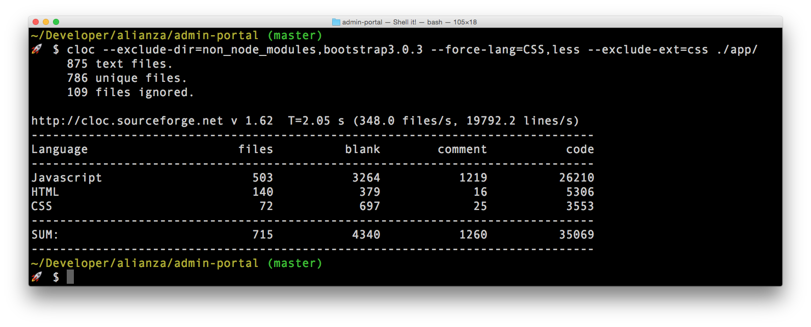

# cloc



This is just an npm distribution of the amazing [cloc](https://github.com/AlDanial/cloc) by [Al Danial](pontifespresso).
[I](https://twitter.com/kentcdodds) created this package because I think `cloc` is awesome, but didn't want to download
the file and commit it to my project.

# Installation and Requirements

## Requirements

### Perl

`cloc` is written in perl and the binary that this package exposes is the `cloc` perl script. You must have perl installed on your machine for this binary to work.

### Node & npm

This is distributed as an `npm` package (some say that stands for "Node Package Manager"). So you must have Node.js and npm installed.
 
Here are quick instructions on how to get those: http://blog.nodeknockout.com/post/65463770933/how-to-install-node-js-and-npm

Congratulations, you've opened your life to a whole new world of awesome tooling and other cool things :-)

## Installation

Install this tool via `npm`: `$ npm install -g cloc`

# Usage

In your terminal, simply type `cloc` to get output of the options available.

See the official [cloc](http://cloc.sourceforge.net/) website for documentation on how to use `cloc`.

Here's the output when you type `cloc`:

```
Usage: cloc [options] <file(s)/dir(s)> | <set 1> <set 2> | <report files>

 Count, or compute differences of, physical lines of source code in the
 given files (may be archives such as compressed tarballs or zip files)
 and/or recursively below the given directories.

 Input Options
   --extract-with=<cmd>      This option is only needed if cloc is unable
                             to figure out how to extract the contents of
                             the input file(s) by itself.
                             Use <cmd> to extract binary archive files (e.g.:
                             .tar.gz, .zip, .Z).  Use the literal '>FILE<' as
                             a stand-in for the actual file(s) to be
                             extracted.  For example, to count lines of code
                             in the input files
                                gcc-4.2.tar.gz  perl-5.8.8.tar.gz
                             on Unix use
                               --extract-with='gzip -dc >FILE< | tar xf -'
                             or, if you have GNU tar,
                               --extract-with='tar zxf >FILE<'
                             and on Windows use, for example:
                               --extract-with="\"c:\Program Files\WinZip\WinZip32.exe\" -e -o >FILE< ."
                             (if WinZip is installed there).
   --list-file=<file>        Take the list of file and/or directory names to
                             process from <file>, which has one file/directory
                             name per line.  Only exact matches are counted;
                             relative path names will be resolved starting from
                             the directory where cloc is invoked.
                             See also --exclude-list-file.
   --vcs=<VCS>               Invoke a system call to <VCS> to obtain a list of
                             files to work on.  If <VCS> is 'git', then will
                             invoke 'git ls-files' to get a file list and
                             'git submodule status' to get a list of submodules
                             whose contents will be ignored.  If <VCS> is 'svn'
                             then will invoke 'svn list -R'.  The primary benefit
                             is that cloc will then skip files explicitly
                             excluded by the versioning tool in question,
                             ie, those in .gitignore or have the svn:ignore
                             property.
                             Alternatively <VCS> may be any system command
                             that generates a list of files.
                             Note:  cloc must be in a directory which can read
                             the files as they are returned by <VCS>.  cloc will
                             not download files from remote repositories.
                             'svn list -R' may refer to a remote repository
                             to obtain file names (and therefore may require
                             authentication to the remote repository), but
                             the files themselves must be local.
   --unicode                 Check binary files to see if they contain Unicode
                             expanded ASCII text.  This causes performance to
                             drop noticeably.

 Processing Options
   --autoconf                Count .in files (as processed by GNU autoconf) of
                             recognized languages.
   --by-file                 Report results for every source file encountered.
   --by-file-by-lang         Report results for every source file encountered
                             in addition to reporting by language.
   --count-and-diff <set1> <set2>
                             First perform direct code counts of source file(s)
                             of <set1> and <set2> separately, then perform a diff
                             of these.  Inputs may be pairs of files, directories,
                             or archives.  See also --diff, --diff-alignment,
                             --diff-timeout, --ignore-case, --ignore-whitespace.
   --diff <set1> <set2>      Compute differences in code and comments between
                             source file(s) of <set1> and <set2>.  The inputs
                             may be pairs of files, directories, or archives.
                             Use --diff-alignment to generate a list showing
                             which file pairs where compared.  See also
                             --count-and-diff, --diff-alignment, --diff-timeout,
                             --ignore-case, --ignore-whitespace.
   --diff-timeout <N>        Ignore files which take more than <N> seconds
                             to process.  Default is 10 seconds.
                             (Large files with many repeated lines can cause
                             Algorithm::Diff::sdiff() to take hours.)
   --follow-links            [Unix only] Follow symbolic links to directories
                             (sym links to files are always followed).
   --force-lang=<lang>[,<ext>]
                             Process all files that have a <ext> extension
                             with the counter for language <lang>.  For
                             example, to count all .f files with the
                             Fortran 90 counter (which expects files to
                             end with .f90) instead of the default Fortran 77
                             counter, use
                               --force-lang="Fortran 90",f
                             If <ext> is omitted, every file will be counted
                             with the <lang> counter.  This option can be
                             specified multiple times (but that is only
                             useful when <ext> is given each time).
                             See also --script-lang, --lang-no-ext.
   --force-lang-def=<file>   Load language processing filters from <file>,
                             then use these filters instead of the built-in
                             filters.  Note:  languages which map to the same
                             file extension (for example:
                             MATLAB/Mathematica/Objective C/MUMPS/Mercury;
                             Pascal/PHP; Lisp/OpenCL; Lisp/Julia; Perl/Prolog)
                             will be ignored as these require additional
                             processing that is not expressed in language
                             definition files.  Use --read-lang-def to define
                             new language filters without replacing built-in
                             filters (see also --write-lang-def).
   --ignore-whitespace       Ignore horizontal white space when comparing files
                             with --diff.  See also --ignore-case.
   --ignore-case             Ignore changes in case; consider upper- and lower-
                             case letters equivalent when comparing files with
                             --diff.  See also --ignore-whitespace.
   --lang-no-ext=<lang>      Count files without extensions using the <lang>
                             counter.  This option overrides internal logic
                             for files without extensions (where such files
                             are checked against known scripting languages
                             by examining the first line for #!).  See also
                             --force-lang, --script-lang.
   --max-file-size=<MB>      Skip files larger than <MB> megabytes when
                             traversing directories.  By default, <MB>=100.
                             cloc's memory requirement is roughly twenty times
                             larger than the largest file so running with
                             files larger than 100 MB on a computer with less
                             than 2 GB of memory will cause problems.
                             Note:  this check does not apply to files
                             explicitly passed as command line arguments.
   --original-dir            [Only effective in combination with
                             --strip-comments]  Write the stripped files
                             to the same directory as the original files.
   --read-binary-files       Process binary files in addition to text files.
                             This is usually a bad idea and should only be
                             attempted with text files that have embedded
                             binary data.
   --read-lang-def=<file>    Load new language processing filters from <file>
                             and merge them with those already known to cloc.
                             If <file> defines a language cloc already knows
                             about, cloc's definition will take precedence.
                             Use --force-lang-def to over-ride cloc's
                             definitions (see also --write-lang-def ).
   --script-lang=<lang>,<s>  Process all files that invoke <s> as a #!
                             scripting language with the counter for language
                             <lang>.  For example, files that begin with
                                #!/usr/local/bin/perl5.8.8
                             will be counted with the Perl counter by using
                                --script-lang=Perl,perl5.8.8
                             The language name is case insensitive but the
                             name of the script language executable, <s>,
                             must have the right case.  This option can be
                             specified multiple times.  See also --force-lang,
                             --lang-no-ext.
   --sdir=<dir>              Use <dir> as the scratch directory instead of
                             letting File::Temp chose the location.  Files
                             written to this location are not removed at
                             the end of the run (as they are with File::Temp).
   --skip-uniqueness         Skip the file uniqueness check.  This will give
                             a performance boost at the expense of counting
                             files with identical contents multiple times
                             (if such duplicates exist).
   --stdin-name=<file>       Give a file name to use to determine the language
                             for standard input.  (Use - as the input name to
                             receive source code via STDIN.)
   --strip-comments=<ext>    For each file processed, write to the current
                             directory a version of the file which has blank
                             lines and comments removed.  The name of each
                             stripped file is the original file name with
                             .<ext> appended to it.  It is written to the
                             current directory unless --original-dir is on.
   --sum-reports             Input arguments are report files previously
                             created with the --report-file option.  Makes
                             a cumulative set of results containing the
                             sum of data from the individual report files.
   --unix                    Override the operating system autodetection
                             logic and run in UNIX mode.  See also
                             --windows, --show-os.
   --use-sloccount           If SLOCCount is installed, use its compiled
                             executables c_count, java_count, pascal_count,
                             php_count, and xml_count instead of cloc's
                             counters.  SLOCCount's compiled counters are
                             substantially faster than cloc's and may give
                             a performance improvement when counting projects
                             with large files.  However, these cloc-specific
                             features will not be available: --diff,
                             --count-and-diff, --strip-comments, --unicode.
   --windows                 Override the operating system autodetection
                             logic and run in Microsoft Windows mode.
                             See also --unix, --show-os.

 Filter Options
   --exclude-dir=<D1>[,D2,]  Exclude the given comma separated directories
                             D1, D2, D3, et cetera, from being scanned.  For
                             example  --exclude-dir=.cache,test  will skip
                             all files and subdirectories that have /.cache/
                             or /test/ as their parent directory.
                             Directories named .bzr, .cvs, .hg, .git, and
                             .svn are always excluded.
                             This option only works with individual directory
                             names so including file path separators is not
                             allowed.  Use --fullpath and --not-match-d=<regex>
                             to supply a regex matching multiple subdirectories.
   --exclude-ext=<ext1>[,<ext2>[...]]
                             Do not count files having the given file name
                             extensions.
   --exclude-lang=<L1>[,L2,] Exclude the given comma separated languages
                             L1, L2, L3, et cetera, from being counted.
   --exclude-list-file=<file>  Ignore files and/or directories whose names
                             appear in <file>.  <file> should have one file
                             name per line.  Only exact matches are ignored;
                             relative path names will be resolved starting from
                             the directory where cloc is invoked.
                             See also --list-file.
   --fullpath                Modifies the behavior of --match-f, --not-match-f,
                             and --not-match-d to include the file's path
                             in the regex, not just the file's basename.
                             (This does not expand each file to include its
                             absolute path, instead it uses as much of
                             the path as is passed in to cloc.)
                             Note:  --match-d always looks at the full
                             path and therefore is unaffected by --fullpath.
   --include-lang=<L1>[,L2,] Count only the given comma separated languages
                             L1, L2, L3, et cetera.
   --match-d=<regex>         Only count files in directories matching the Perl
                             regex.  For example
                               --match-d='/(src|include)/'
                             only counts files in directories containing
                             /src/ or /include/.  Unlike --not-match-d,
                             --match-f, and --not-match-f, --match-d always
                             compares the fully qualified path against the regex.
   --not-match-d=<regex>     Count all files except those in directories
                             matching the Perl regex.  Only the trailing
                             directory name is compared, for example, when
                             counting in /usr/local/lib, only 'lib' is
                             compared to the regex.
                             Add --fullpath to compare parent directories to
                             the regex.
                             Do not include file path separators at the beginning
                             or end of the regex.
   --match-f=<regex>         Only count files whose basenames match the Perl
                             regex.  For example
                               --match-f='^[Ww]idget'
                             only counts files that start with Widget or widget.
                             Add --fullpath to include parent directories
                             in the regex instead of just the basename.
   --not-match-f=<regex>     Count all files except those whose basenames
                             match the Perl regex.  Add --fullpath to include
                             parent directories in the regex instead of just
                             the basename.
   --skip-archive=<regex>    Ignore files that end with the given Perl regular
                             expression.  For example, if given
                               --skip-archive='(zip|tar(.(gz|Z|bz2|xz|7z))?)'
                             the code will skip files that end with .zip,
                             .tar, .tar.gz, .tar.Z, .tar.bz2, .tar.xz, and
                             .tar.7z.
   --skip-win-hidden         On Windows, ignore hidden files.

 Debug Options
   --categorized=<file>      Save names of categorized files to <file>.
   --counted=<file>          Save names of processed source files to <file>.
   --diff-alignment=<file>   Write to <file> a list of files and file pairs
                             showing which files were added, removed, and/or
                             compared during a run with --diff.  This switch
                             forces the --diff mode on.
   --explain=<lang>          Print the filters used to remove comments for
                             language <lang> and exit.  In some cases the
                             filters refer to Perl subroutines rather than
                             regular expressions.  An examination of the
                             source code may be needed for further explanation.
   --help                    Print this usage information and exit.
   --found=<file>            Save names of every file found to <file>.
   --ignored=<file>          Save names of ignored files and the reason they
                             were ignored to <file>.
   --print-filter-stages     Print processed source code before and after
                             each filter is applied.
   --show-ext[=<ext>]        Print information about all known (or just the
                             given) file extensions and exit.
   --show-lang[=<lang>]      Print information about all known (or just the
                             given) languages and exit.
   --show-os                 Print the value of the operating system mode
                             and exit.  See also --unix, --windows.
   -v[=<n>]                  Verbose switch (optional numeric value).
   -verbose[=<n>]            Long form of -v.
   --version                 Print the version of this program and exit.
   --write-lang-def=<file>   Writes to <file> the language processing filters
                             then exits.  Useful as a first step to creating
                             custom language definitions (see also
                             --force-lang-def, --read-lang-def).

 Output Options
   --3                       Print third-generation language output.
                             (This option can cause report summation to fail
                             if some reports were produced with this option
                             while others were produced without it.)
   --by-percent  X           Instead of comment and blank line counts, show
                             these values as percentages based on the value
                             of X in the denominator:
                                X = 'c'   -> # lines of code
                                X = 'cm'  -> # lines of code + comments
                                X = 'cb'  -> # lines of code + blanks
                                X = 'cmb' -> # lines of code + comments + blanks
                             For example, if using method 'c' and your code
                             has twice as many lines of comments as lines
                             of code, the value in the comment column will
                             be 200%.  The code column remains a line count.
   --csv                     Write the results as comma separated values.
   --csv-delimiter=<C>       Use the character <C> as the delimiter for comma
                             separated files instead of ,.  This switch forces
   --json                    Write the results as JavaScript Object Notation
                             (JSON) formatted output.
   --md                      Write the results as Markdown-formatted text.
   --out=<file>              Synonym for --report-file=<file>.
   --progress-rate=<n>       Show progress update after every <n> files are
                             processed (default <n>=100).  Set <n> to 0 to
                             suppress progress output (useful when redirecting
                             output to STDOUT).
   --quiet                   Suppress all information messages except for
                             the final report.
   --report-file=<file>      Write the results to <file> instead of STDOUT.
   --sql=<file>              Write results as SQL create and insert statements
                             which can be read by a database program such as
                             SQLite.  If <file> is -, output is sent to STDOUT.
   --sql-append              Append SQL insert statements to the file specified
                             by --sql and do not generate table creation
                             statements.  Only valid with the --sql option.
   --sql-project=<name>      Use <name> as the project identifier for the
                             current run.  Only valid with the --sql option.
   --sql-style=<style>       Write SQL statements in the given style instead
                             of the default SQLite format.  Currently, the
                             only style option is Oracle.
   --sum-one                 For plain text reports, show the SUM: output line
                             even if only one input file is processed.
   --xml                     Write the results in XML.
   --xsl=<file>              Reference <file> as an XSL stylesheet within
                             the XML output.  If <file> is 1 (numeric one),
                             writes a default stylesheet, cloc.xsl (or
                             cloc-diff.xsl if --diff is also given).
                             This switch forces --xml on.
   --yaml                    Write the results in YAML.
```

## Locally in a project

I use this in my project to keep track of my lines of code as the project grows (mostly for fun). Here's what I do:

1. Install it as one of your `devDependencies` with `$ npm i -D cloc`
2. Add this to your `package.json`:

```javascript
{
  // your other config stuff
  "scripts": {
    "count": "cloc app/" // <-- other options would go here as well...
  },
  "devDependencies": {
    "cloc": "2.0.0" // <-- this should be added automatically when you install with the `-D` flag
  }
  // more config stuff
}
```

3. Whenever you want to count your lines of code, simply enter: `$ npm run count`

# LICENSE

This package is and the `cloc` cli itself is licensed with GPL 2.

