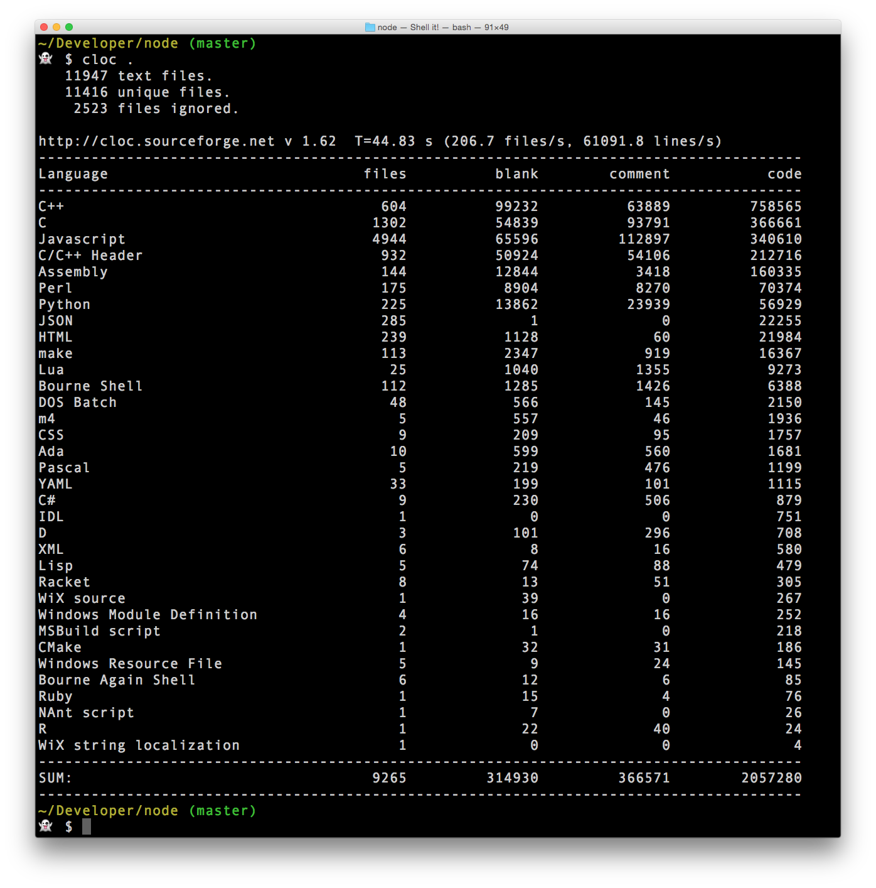

# cloc



This is just an npm distribution of the amazing [cloc](http://cloc.sourceforge.net/) by [Al Danial](pontifespresso).
[I](https://twitter.com/kentcdodds) created this package because I think `cloc` is awesome, but didn't want to download
the file and commit it to my project.


# Installation and Requirements

`cloc` is written in perl and the binary that this package exposes is the `cloc` perl script. You must have perl installed on your machine for this binary to work.

Install this tool via `npm`: `$ npm install -g cloc`

# Usage

In your terminal, simply type `cloc` to get output of the options available.

See the official [cloc](http://cloc.sourceforge.net/) website for documentation on how to use `cloc`.

## Locally in a project

I use this in my project to keep track of my lines of code as the project grows (mostly for fun). Here's what I do:

1. Install it as one of your `devDependencies` with `$ npm i -D cloc`
2. Add this to your `package.json`:

```javascript
{
  // your other config stuff
  "scripts": {
    "count": "cloc app/" // <-- other options would go here as well...
  }
  // more config stuff
}
```

3. Whenever you want to count your lines of code, simply enter: `$ npm run count`


# LICENSE

This package is MIT licensed. However the `cloc` library itself is licensed with GPL 2.
